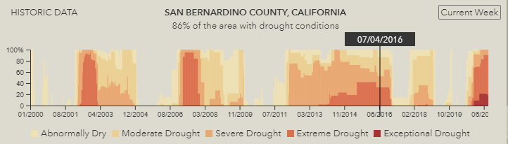
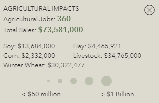

# Drought Aware Application

Drought occurs when a region experiences an imbalance between water supply and water demand over an extended period of time. Droughts can have significant environmental, economic, and social consequences. Between 1980 and the present time, the cost of drought exceeded 100 billion dollars, making drought monitoring a key factor in planning, preparedness, and mitigation efforts at all levels of government. 

This [Drought Aware Application] provides access to current and historical drought maps for the entire US. These maps have been produced weekly since January 4, 2000 by the U.S. Drought Monitor and the full time series is archived here. Drought intensity is classified according to the deviation of precipitation, stream flow, and soil moisture content from historically established norms, in addition to subjective observations and reported impacts from than 350 partners across the country. A new map is released every Thursday to reflect the conditions of the previous week.

## Features
Click on the [map] to get a graph of historical drought conditions for any county or state. 
The scrubber on the zoomable time series at the bottom of the app allows you to change the time period displayed on the map. 

#### Time series chart
\
*Zoomable time series chart*

#### Drought conditions and outlook for the selected county or state
\
*Drought condition and outlook*

#### Agricultural Impacts 
\
*Current agriculture data*

## Deprecated Features
The ability to login to the application with your ArcGIS Online credentials and save a view of the map is no longer supported in this application.

## Run or Modify the Application
Follow these steps to host the code locally and make modifications:

1. Download the code.
2. Open the terminal and navigate to the root of this project
3. Run `npm install`
4. Run `npm run start`
5. Make your modifications.

## Resources
Additional drought content is available to the GIS community for custom mapping or analysis in the [Living Atlas of the World](https://livingatlas.arcgis.com/en/#s=0). 
To access the full set of historical content Jan-2000 to present go to [USA Drought Intensity 2000 - Present](https://www.arcgis.com/home/item.html?id=9731f9062afd45f2be7b3bf2e050fbfa). 
To see only most current weekly map go to [USA Drought Intensity (Current Conditions)](https://www.arcgis.com/home/item.html?id=7d4cc55ecaef4ceb82c8d05b13e0d049). 

[United States Department of Agriculture]

[United States Census]

[National Integrated Drought Information System]

## Issues

Find a bug or want to request a new feature?  Please let us know by submitting an issue.

## Contributing

Esri welcomes contributions from anyone and everyone. Please see our [guidelines for contributing](https://github.com/esri/contributing).

## Licensing
Licensed under the Apache License, Version 2.0 (the "License");
you may not use this file except in compliance with the License.
You may obtain a copy of the License at

   http://www.apache.org/licenses/LICENSE-2.0

Unless required by applicable law or agreed to in writing, software
distributed under the License is distributed on an "AS IS" BASIS,
WITHOUT WARRANTIES OR CONDITIONS OF ANY KIND, either express or implied.
See the License for the specific language governing permissions and
limitations under the License.

A copy of the license is available in the repository's [license.txt]( https://raw.github.com/Esri/drought-tracker/master/LICENSE.txt) file.

[//]: # (These are reference links used in the body of this note and get stripped out when the markdown processor does its job. There is no need to format nicely because it shouldn't be seen. Thanks SO - http://stackoverflow.com/questions/4823468/store-comments-in-markdown-syntax)

   [United States Department of Agriculture]: <https://www.nass.usda.gov/>
   [United States Census]: <https://www.census.gov/>
   [National Integrated Drought Information System]: <https://www.drought.gov/current-conditions>
   [Drought Aware Application]: <http://livingatlas.arcgis.com/droughtaware/>
   [map]: <http://livingatlas.arcgis.com/droughtaware/>
